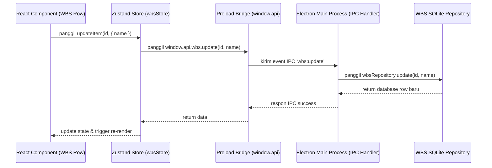

# Panduan Arsitektur & Teknis Aplikasi

Dokumen ini menjelaskan struktur internal, pola desain, alur data, serta detail algoritma utama yang diimplementasikan dalam aplikasi **Master RAB**.

---

## 1. Peta Struktur Repositori

```text
├── electron/
│   ├── main/
│   │   ├── database/
│   │   │   ├── repositories/    # Query SQLite spesifik (AHS, RAB, WBS, Project)
│   │   │   ├── connection.ts    # Inisialisasi SQL.js & sinkronisasi write ke disk
│   │   │   └── schema.ts        # Script pembuatan tabel DDL & indeks database
│   │   ├── services/            # Logika bisnis backend (perhitungan RAB, import AHSP, ekspor PDF/Excel)
│   │   ├── index.ts             # Entry point Electron Main Process
│   │   └── ipc.ts               # Pendaftaran handler IPC (Inter-Process Communication)
│   └── preload/
│       └── index.ts             # Ekspos bridge API ke konteks jendela Chrome (window.api)
├── src/
│   ├── components/
│   │   ├── ahs/                 # Komponen modular manajemen library AHS
│   │   ├── rab/                 # Baris tabel WBS & kartu summary RAB
│   │   ├── reports/             # Halaman kompilasi cetak (Rekap, Detail, BOM, Backup, S-Curve)
│   │   └── volume-calculator/   # Kalkulator dimensi & kalkulator penampang besi + SVG
│   ├── hooks/                   # Custom hook logika pemrosesan ekspor (Excel/PDF) & state data
│   ├── lib/                     # Utilitas pemformatan uang dan pelafalan ejaan Rupiah (terbilang)
│   ├── pages/                   # Container halaman utama (Project, AHS Library, Laporan Launcher)
│   ├── stores/                  # Global client-side state manager (Zustand)
│   └── types/                   # Interface data model TypeScript yang selaras dengan database
```

---

## 2. Alur Inter-Process Communication (IPC Bridge)

Aplikasi menggunakan pola **Context Isolation** demi keamanan maksimal. Frontend React tidak memiliki akses langsung ke modul Node.js (seperti `fs`, `path`, atau SQLite). Komunikasi dijembatani melalui Preload script di `electron/preload/index.ts` yang mengekspos properti `window.api`.

### Contoh Aliran Pemanggilan API (WBS Item Update):


---

## 3. Database Layer & Persistensi (SQLite via sql.js)

Karena aplikasi berjalan sepenuhnya secara lokal di sisi client (*offline-first*), kami memilih untuk menggunakan **SQLite** sebagai database relasional. Untuk mempermudah kompilasi silang di berbagai OS (tanpa native binding node-gyp), digunakan **sql.js** (engine SQLite yang di-compile ke WebAssembly/ASM.js).

### Mekanisme Sinkronisasi Database:
1. Saat aplikasi dijalankan, `initDatabase()` di `electron/main/database/connection.ts` akan membaca berkas binary SQLite dari `%APPDATA%/master-rab/data/master-rab.sqlite`.
2. Berkas dimuat ke dalam memori RAM sebagai objek `SqlJsDatabase`.
3. Seluruh transaksi tulis/baca berjalan super cepat di memori (RAM).
4. Setiap kali terjadi operasi penulisan (*insert/update/delete*), service akan memicu pemanggilan `saveDatabase()` yang menulis kembali seluruh buffer data memori ke berkas fisik di disk secara sinkronus agar tidak kehilangan data jika aplikasi tertutup.

---

## 4. State Management (Zustand)

Manajemen state di sisi React dikelola oleh pustaka **Zustand** yang terbagi menjadi beberapa store independen namun terkoordinasi:

- **`useRabStore`**: Menyimpan data perhitungan RAB aktif (`RabCalculation`). Menyediakan fungsi `calculate` untuk menghitung subtotal biaya dasar, jumlah PPN, persentase overhead, dan grand total.
- **`useWbsStore`**: Mengelola status struktur pohon WBS pekerjaan proyek.
- **`useVolumeStore`**: Mengelola data volume pekerjaan yang terikat pada item WBS, termasuk formula string kalkulator volume.
- **`useProjectVolumeStore`**: Mengelola data volume proyek bersama yang dapat dirujuk oleh beberapa item pekerjaan WBS (*project-wide shared volumes*).
- **`useAhsStore`**: Mengelola library Analisa Harga Satuan Pekerjaan lokal.

---

## 5. Implementasi Algoritma Kustom Utama

### A. Algoritma Interpolasi Spline Catmull-Rom (Kurva S)
Untuk menghasilkan visualisasi garis akumulasi progress Kurva S yang halus (*smooth curves*) tanpa patahan tajam di grafik SVG, digunakan algoritma interpolasi **Catmull-Rom** untuk menerjemahkan kumpulan titik koordinat progress $P_i$ menjadi lintasan Bezier Kubik (`d="M ... C ..."`):

```typescript
// Titik kontrol cp1 dan cp2 dihitung dengan menyertakan bobot tetangga
const cp1x = p1.x + (p2.x - p0.x) * tension;
const cp1y = p1.y + (p2.y - p0.y) * tension;

const cp2x = p2.x - (p3.x - p1.x) * tension;
const cp2y = p2.y - (p3.y - p1.y) * tension;
```
Di mana nilai `tension` diatur ke **0.15** untuk menghasilkan lengkungan minimalis yang natural dan akurat tanpa mengalami *overshoot* ekstrem di luar koordinat titik data asli.

### B. Algoritma Kalkulasi Berat Besi & Sengkang Beton
Pada modul Volume Calculator [ConcreteSectionForm.tsx](file:///d:/ABIMANYU/Devlab/MasterRAB/src/components/volume-calculator/tabs/steel/ConcreteSectionForm.tsx), berat total besi tulangan dihitung otomatis dengan memisahkan dua komponen utama:

#### 1. Tulangan Utama (Longitudinal):
$$W_{\text{utama}} = \sum \left( Qty_{\text{baris}} \times L_{\text{bentang}} \times w_{\text{diameter}} \times Qty_{\text{elemen}} \right)$$
Di mana $w_{\text{diameter}}$ adalah berat besi per meter linear berdasarkan diameternya:
$$w = 0.006165 \times d^2$$

#### 2. Tulangan Begel/Sengkang (Transversal):
- **Panjang satu begel ($L_{\text{begel}}$)**:
  $$L_{\text{begel}} = 2 \times (b - 2c) + 2 \times (h - 2c) + 12d_{\text{begel}}$$
  *Catatan: Nilai $12d_{\text{begel}}$ mewakili panjang tekukan kait standar sengkang sipil (135° Hook).*
  
- **Jumlah begel ($N_{\text{begel}}$)**:
  - Mode **Uniform**:
    $$N_{\text{begel}} = \lfloor \frac{L_{\text{bentang}} \times 1000}{Spacing} \rfloor + 1$$
  - Mode **Split** (Tumpuan & Lapangan):
    $$N_{\text{begel}} = \lfloor \frac{\frac{L_{\text{bentang}}}{2} \times 1000}{Spacing_{\text{tumpuan}}} \rfloor + \lfloor \frac{\frac{L_{\text{bentang}}}{2} \times 1000}{Spacing_{\text{lapangan}}} \rfloor + 1$$
    *(Tumpuan dipasang di 1/4 bentang kiri + 1/4 bentang kanan, Lapangan di 1/2 bentang tengah).*
- **Berat Total Sengkang**:
  $$W_{\text{sengkang}} = N_{\text{begel}} \times L_{\text{begel}} \times w_{\text{begel}} \times Qty_{\text{elemen}}$$
